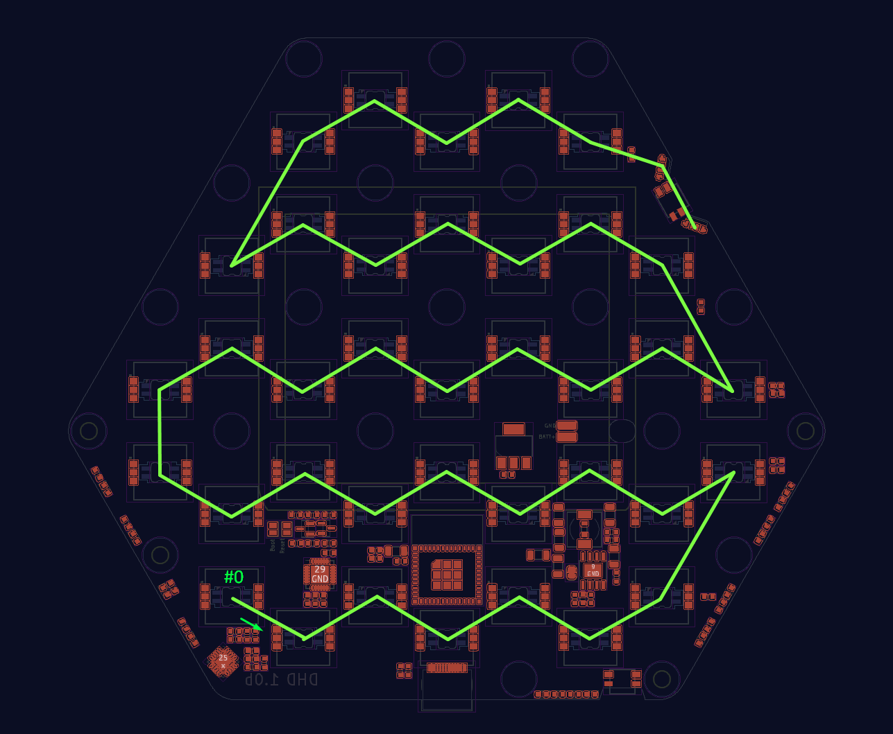

---
hide:
  - navigation
---

Hardware specifications and documentation

!!! warning "This page is under construction"

## Stargate

The Stargate uses the **ESP32-PICO-MINI-02** as its core module, which features both Wi-Fi and Bluetooth capabilities. It is powered through a USB-C connector that also allows for flashing newer or customized firmware.

The Stargate utilizes Bluetooth to communicate with the web interface, enabling sound effects playback and control without the DHD. It also uses Espressif's ESP-NOW protocol to communicate with the remote DHD.

The gate is comprised of nine PCB segments, with the bottom segment being the core segment.

#### LEDs
##### Chain #1 (IO13) 

<small>

- 72x SK6812SIDE-A LEDs for wormhole and shield effect
- 72x SK6812MINI-E LEDs for symbols
- 27x SK6812MINI-E LEDs for chevrons

The LEDs are chained counter-clockwise across the gate starting from the core (bottom) segment. Order of the LEDs on each segment counter-clockwise: **s-w-w-s-w-s-w-s-w-s-w-s-w-s-w-s-ch-ch-ch** *(s: symbol, w: wormhole, ch: chevron)*

</small>

##### Chain #2 (IO25) 

<small>

- Combination of 12 SK6812SIDE-A and 6 WS1812B LEDs across the three engines

</small>

## DHD

The DHD uses **ESP32-PICO-MINI-02** as it's core module as well as the Stargate does. The DHD can be charged through a USB-C connector that also allows for flashing of newer or customized firmware. It communicates with the Stargate via Espressif's ESP-NOW protocol.

#### Buttons

<small>

There are 36 symbol buttons, 1 center button, and 1 shield side button. All these buttons are connected into a matrix which is handled by TCA8418RTWR IC that is connected to the ESP32 module via I2C bus.

</small>

#### LEDs

<small>

- 37x SK6812MINI-E LEDs for the front buttons (symbols and center button)
- 2x SK6812SIDE-A LEDs for the shield button

[{: style="max-height:30vh;"}](images/dhd-led.png){:target="_blank"}

</small>