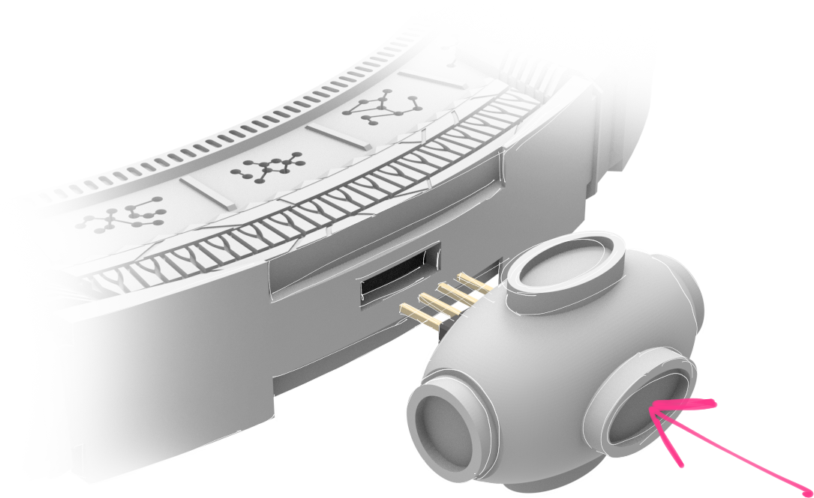
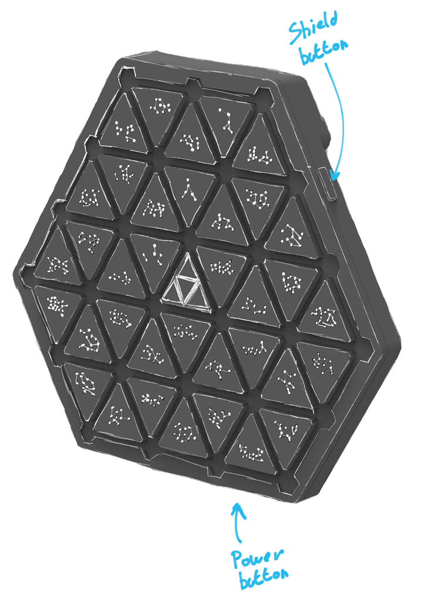

---
hide:
  - navigation
---

# Quickstart guide

!!! warning "This page is under construction"

## 1. Accessories

Place the gate in the provided stand, or hang it onto a wall using the wall hanger.

<small>
!!! tip "Tip: the gate works best when placed against a wall with 4-6cm gap."
</small>

#### Optionally, attach the engines
- The engines will work only with a correct pin orientation. 
- The engines will turn on only during the gate powerup. When attached to already powered gate, the engines won't turn on.
- All the engines need to be attached to turn on

{: style="max-height:30vh;"}

## 2. Power up the gate

Connect a 5V@3A power supply to the USB-C port at the bottom of the Stargate. 

## 3. Connect to the Stargate web interface

Open up the [interface](https://forgemark.github.io/SGA-Client/) on a phone or a computer and connect the gate via Bluetooth. The interface can be used to control the gate, and it provides a way for the gate to play sound effects.

## 4. Power up the DHD

Power up the DHD by pressing the button on the bottom side. **To turn it off later, double tap the button.**

{: style="max-height:60vh;"}

## 5. Dial the gate!

Just use random 7 symbols, for now :) Specific addresses coming in the future firmware together with a bunch of extra features.